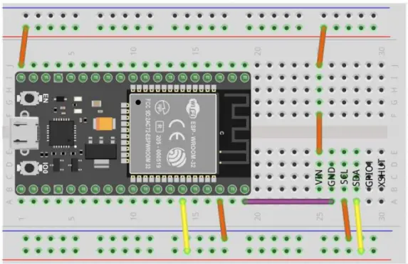
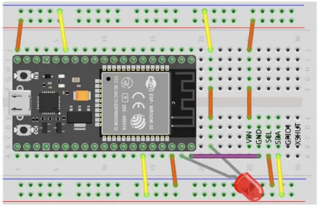

# マイコン実習 ESP32 **レーザー距離センサ**
> ESP32 モジュールを用いり、距離センサの制御をおこなう。Arduino 言語、ArduinoIDE ソフトなどの学習を習得する。サンプルプログラムより仕様に合わせた実行可能プログラムを組み上げる。


## 課題①
> 
```c
#include <Wire.h>
#include <VL53L0X.h>
VL53L0X sensor;

void setup()
{
    Serial.begin(115200);
    Wire.begin();
    sensor.init();
}

void loop()
{
    int val;
    val = sensor.readRangeSingleMillimeters();
    Serial.println(val);
    delay(500);
}
```



## 課題②
> 距離センサより得た値が 50 以下になったら、LED を点灯させ、シリアルモニタに"STOP"と表示する。
```c
#include <Wire.h>
#include <VL53L0X.h>
VL53L0X sensor;

void setup()
{
    Serial.begin(115200);
    Wire.begin();
    sensor.init();
    pinMode(23,OUTPUT);
}

void loop()
{
    int val;
    val = sensor.readRangeSingleMillimeters();
    if (val<=50) {
        Serial.print(val);
        Serial.println(":Stop");
        digitalWrite(23,HIGH);
    }
    else {
        Serial.println(val);
        digitalWrite(23,LOW);
    }
    delay(500);
}
```
